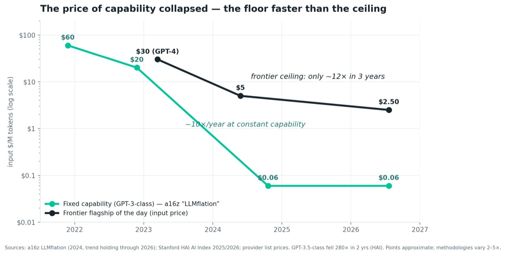
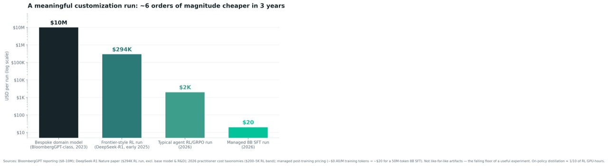

A pattern I keep seeing: agent demos look good in week one. The hard part starts later, when the agent has to work with real context, real tools, real permissions, real latency, real cost, and real users.

That failure pattern is easy to misdiagnose as a model problem. Sometimes it is. Across generations, model quality matters enormously: Verified SWE-bench scores moved from roughly 4% to the high seventies in three years, and no amount of prompt polish or tool wrapping would have closed that gap. A small open model with a beautiful harness still cannot do what a frontier model does on genuinely hard, long-horizon work. The capability has to be there.

But within the current frontier tier, the practical question changes. The model sets the ceiling. Engineering decides how much of that ceiling you actually reach.

This post is about that engineering layer: evals, context, tools, routing, serving, and the point where "customizing" quietly turns into "owning" something you now have to maintain. I use one ladder throughout: **use agents → customize agents → own the machinery**.

The ladder is not a sophistication ranking. Each rung buys a different kind of value, carries a different maintenance burden, and needs a different gate before you climb. Fine-tuning and RL show up near the end, because they matter. But they are not the destination. They are one branch of ownership, and often not the branch teams should reach for first.

The production data points in the same direction. Teams are not usually abandoning agent pilots because they picked obviously weak models. They picked capable models and then hit production reality. IDC found that only about 4 of every 33 agent proof-of-concepts reach production, an ~88% attrition rate. Practitioner analyses through 2026 consistently attribute a large share of enterprise agent failures to context and integration problems rather than raw model capability. S&P Global's 2025 enterprise survey found the share of companies abandoning most of their AI initiatives rose from 17% to 42% in a single year, with the average organization scrapping 46% of its proofs-of-concept before they shipped.

So the durable question is not "Which model wins?" That answer changes every quarter. The better question is: what should you build around the model, and when is it worth taking ownership of the machinery?

## TL;DR

- **Start with measurement.** Without task-level evals, traces, cost per task, and regression gates, every optimization is mostly a guess.
- **Use agents** when the goal is individual throughput: faster drafts, faster coding, faster research, faster analysis.
- **Customize agents** when the workflow has to become dependable at volume: better context, better tools, skills, guardrails, routing, caching, and cascades.
- **Own machinery** only when a gate fires: sovereignty, latency, volume, compliance, or a capability plateau that cheaper customization cannot clear.
- **Separate harness ownership from model ownership.** Replacing memory, compaction, orchestration, or tool-calling internals can be as consequential as fine-tuning weights.
- **Fine-tuning and RL are tools, not the destination.** They make sense only when you have the training signal: demonstrations, a teacher model, or an automatic verifier.
- **The eval is the artifact that compounds.** It starts as a scorecard, becomes a deployment gate, and eventually becomes an environment and reward signal if you train.
- **Most workflows should stop at customization.** That is usually where reliability, lower unit cost, safer rollout, and reusable operating discipline show up.

## What each rung unlocks — and where value actually lands

Before getting into evals, context windows, tools, and fine-tuning, separate the business value of each rung. The rungs do not buy the same thing.

- **Use agents** unlocks **individual throughput**: an hour back per person per day, on tasks they were already doing. *This value scales with headcount* — a hundred people saving an hour is a hundred speedups, and it stops when hiring stops.
- **Customize agents** unlocks **a dependable process that scales with volume**: reliability high enough to remove the human check on every run, and unit economics good enough to run it ten thousand times a day instead of ten. This is what decouples output from headcount, and it is what converts a personal speedup into something visible in the P&L — a task that works 70% of the time is a demo; one that works 95% of the time at a known cost per run is a process. It is also where most of the cost reduction you will ever capture actually happens.
- **Own the machinery** unlocks **a different cost structure at volume**, **a moat** (air-gapped deployment, sovereignty, proprietary behavior), and **capability the frontier is weak at** (narrow, idiosyncratic, or proprietary-data tasks where a generalist model underperforms no matter how well you prompt it).

The cost story is easy to misread. People often associate ownership with lower cost, but many of the biggest cost levers sit one rung earlier. Compaction, routing, cascades, and caching all live at the customize rung, and stacked they routinely cut an inference bill 60–80% (batch APIs add more, but only on offline workloads). Distillation and multi-LoRA serving at scale are documented at 75–87%. Those magnitudes are comparable, which means **most of the absolute margin available to most teams is unlocked at the customize rung, not by owning anything.**

The difference is in kind. When you customize, you pay less for roughly the same thing. The levers are cheap, reversible, and available to everyone, which also means they differentiate you from nobody. Your competitor can get the same cache discount from the same vendor. When you own the model, you change *what does the work*: a distilled small model running your task at a fraction of frontier cost. That is a structurally different curve, one fewer competitors will bother to climb, and one that compounds as volume grows.

Cost advantage is also the most perishable ownership benefit. Frontier prices fall roughly 10× a year at constant capability, and prompt caching has already pushed the volume at which a fine-tune beats a cached prompt up by roughly an order of magnitude (the numbers are in Layer 4, below). A cost advantage you buy with a fine-tune today is partly refunded to your competitors by the market next year. Moat and capability do not erode the same way. Nobody's price cut gives your competitor an air-gapped deployment or a model that understands your internal taxonomy. If you are customizing purely for margin, check the crossover math every quarter. If you are customizing for capability, you are on much firmer ground.

That capability unlock deserves emphasis, because it is the reason owning the model isn't merely a cost play. Frontier models are generalists; there are tasks where the ceiling of prompting sits well below requirement — closed-vocabulary classification over an internal taxonomy, a coding standard nobody has published, a domain judgment encoded in years of proprietary decisions. In one documented comparison, a fine-tuned 7B model reached 88% accuracy on a narrow classification task where a prompted frontier model managed 31% — a gap no prompt was going to close. That is not a margin story. That is a capability the frontier does not have and will not acquire on your behalf.

"Scaling" at the customize rung means three distinct things, and it is worth separating them. **Volume**: routing, caching, batching, and reliability are what let the same workflow run ten thousand times a day — cost per run is irrelevant in a pilot and dominant in production. **Task horizon**: context engineering, compaction, and memory extend how long an agent runs before a human has to intervene, which is scaling *within* a task rather than across tasks. **Organizational breadth**: evals, traces, and skills are transferable artifacts that a second team inherits, whereas a stage-1 prompting trick lives in one person's head. Customization work is what lets agent capability spread across an organization instead of staying with whoever was curious.

Do not expect value to rise smoothly with sophistication. Across the 2025–2026 evidence base it looks more like a J-curve with a fork at the end: off-the-shelf adoption creates real but shallow value; value then *dips* at the pilot-to-production transition, where the 42% abandonment number lives; then it rises once the agent becomes a dependable process. The dip has a simple cause: scale exposes the weaknesses a pilot concealed. At ten runs, a 70% success rate reads as promise and nobody notices the token bill. At ten thousand runs, both are undeniable. Customizing an agent is the work of surviving contact with scale.

Three independent surveys converge on a striking concentration figure: roughly 5–6% of organizations capture the bulk of measured AI value. BCG's "future-built" cohort is 5% of 1,250 surveyed firms; McKinsey's high performers (those reporting more than 5% EBIT impact) are about 6% of nearly 2,000; MIT's much-debated GenAI Divide report put the share of pilots extracting significant value at 5%. What separates that cohort is not model customization. McKinsey's strongest correlate of EBIT impact — stronger than any technology factor tested — is whether the organization fundamentally redesigned the workflow the agent operates in. The MIT report's own diagnosis of the 95% that stall is an integration-and-learning gap, not a model-capability gap.

The stage-by-stage value map is easier to read as a table:

| Rung | What it buys | Time to value | Main catch |
|---|---|---:|---|
| Use agents | Individual productivity | Days | High adoption does not automatically become enterprise impact |
| Customize agents | Dependable process at known reliability and cost | Weeks to months | Requires evals, traces, workflow redesign, and ownership of rollout quality |
| Own the machinery | Different cost structure, moat, or narrow capability the frontier lacks | Quarters | Pays only after specific gates fire, and must be revalidated as models move |

The evidence fits that shape. Stage 1 productivity is real: the controlled GitHub Copilot experiment measured a 55.8% task-completion speedup, and field RCTs across thousands of developers landed in the 8–42% range depending on task and measurement. But adoption is not transformation. McKinsey finds 88% of organizations now use AI while only 39% report *any* enterprise EBIT impact, most of it under 5%.

Stage 2 is where process-level P&L starts to concentrate: Klarna's assistant handled 2.3 million conversations while resolution times fell from 11 minutes to 2, with a company-reported ~$40M profit improvement. That is a Stage 2 win: an off-the-shelf model plus heavy workflow integration. The same rung includes 60–80% inference-bill reductions from stacked routing, caching, and batching, and reliability gains from comprehensive evals.

Stage 3 can be valuable, but it is conditional. The payoff is a different cost structure at volume, an air-gapped or sovereign deployment, or a narrow capability that generalist frontier models do not have. Its time-to-value is measured in quarters, and it should not be the default path.

Caveat: nearly all maturity-to-returns research is self-reported executive survey data, not audited financials. The 5–6% convergence across independent surveys strengthens it, but specific ROI multiples should be treated as directional. The most defensible numbers for an executive audience are the cost reductions from stacked Stage 2 optimization, quoted above. They are engineering measurements, reproduced independently, rather than survey self-reports.

## The ladder, and the artifact that climbs it with you

With the value map in mind, define the ladder more carefully.

**Use agents** is literacy: operating off-the-shelf agents on vendor defaults — coding agents, research agents, agentic features inside existing products. The skills are task selection, competent prompting, knowing when to trust versus verify, and basic security hygiene. No harness, no infrastructure.

**Customize agents** is everything that improves the agent without taking ownership of model weights or harness internals: evaluation and observability, context engineering, tool curation and skills, guardrails, and model routing. One caveat about the name, since it undersells the most important part: this rung *begins* with measurement. Evals and tracing are not customization in any ordinary sense, and they are the foundation everything else here rests on. Think of the rung as "measure, then shape" — the shaping is what most people mean by customizing an agent, and the measuring is what determines whether the shaping worked. This is also where the pilot-to-production failure gap lives; most organizations stall between stage one and stage two, not between two and three.

**Own the machinery** changes the substance rather than the configuration — and it splits into two branches that are routinely conflated: owning the **harness** (mechanisms inside the agent's decide-act-remember loop) and owning the **model** (self-hosted inference, supervised fine-tuning, reinforcement learning, distillation). The model branch is what most discussions of "customization" eventually reach for. The harness branch carries a comparable ownership burden with almost none of the recognition, which is why the next section is devoted to telling them apart.

A note on vocabulary, because it matters for how you read the rest of this. Much of the industry uses "customize" for everything past the defaults, including work that means maintaining a fork forever. We split that in two deliberately: **customizing** is building around an agent through surfaces the vendor supports and maintains; **owning** is taking over machinery the vendor used to maintain. The distinction is not pedantic — it is the difference between work that survives your next upgrade for free and work you will re-validate on every release.

Two properties of the ladder matter in practice. It is *cumulative* — stage three never removes the need for stage two's evals, context work, and cost control — and it is *per-workflow*, not per-organization. A team can legitimately be at "own" on its document-extraction pipeline and at "use" on everything else.

And one artifact climbs the ladder with you: **the eval graduates**. At the literacy stage you eyeball outputs. At the customize rung the eval becomes a harness — baselines, regression suites, gated rollouts. At the own rung that same harness becomes an environment (add programmatic reset, steppable state, and a reward in place of a pass/fail score), and the environment is what supplies the training signal for reinforcement learning. Eyeball → harness → environment → reward signal. Measurement matures into training signal, which is why the cheapest layer in the stack is also the entry ticket to the most expensive one. That single through-line gives executives the maturity story and engineers the technical thread, in one arc.

## Which rung is this, actually? A classification test

The ladder is only useful if you can place a specific piece of work on it, and in practice this is where teams argue. Four tests, applied in order, settle most cases.

**The upgrade test.** A better model or a new version of your harness ships tomorrow. Is adoption free? If yes, you are customizing. If adoption requires retraining, revalidation, or merging, you are owning.

**The loop test.** Have you taken ownership of a mechanism *inside* the agent's decide-act-remember loop? Adapters at the boundary — connectors, integrations, tools the agent calls — don't count. Machinery the agent runs on does.

**Instruct versus own.** Are you telling the agent what to do, or replacing the machinery that does it? Instruction is configuration; replacement is ownership.

**Behavior-transparent versus behavior-altering.** Can the mechanism change what the agent *does*, or only what it costs? Some machinery is designed to be output-neutral — the same answer, cheaper or faster. Other machinery decides which model answers, or what the agent still remembers when it answers. Owning something behavior-altering counts as ownership even when it looks like plumbing, because you have taken responsibility for a determinant of the output and you now have to eval it forever.

Run some common work through them. **Wrapping existing APIs and systems of record in an open tool protocol** is customization — it's a boundary adapter, it's model-agnostic, and a new model inherits it for free. **Adding bespoke tools the harness can call** is customization too, with one exception noted below. **Adding skills** is customization — the top rung of it, but still instruction-shaped: versionable, portable, free to abandon. **Telling the agent to compact its context** is customization and about as cheap as a rung gets. But **changing how compaction works** — replacing the summarization policy, deciding what survives a compaction event — is harness ownership, because you now own a mechanism the runtime used to own. **Memory splits the same way**: switching on a runtime's built-in memory feature is customization; building the memory system, its write policy, and its consolidation logic is ownership.

The cost levers are where that fourth test earns its keep, because they look homogeneous and are not. **Caching and batching are behavior-transparent by design**: a cache read returns the same tokens as a cache miss, and a batched request returns the same answer as a live one. Turning on a vendor cache, restructuring a prompt so its prefix is stable, or submitting work to a batch endpoint is customization — documented extension points, free on upgrade, no new determinant of output. **Routing and compaction are behavior-altering by design**: one changes which model answers, the other changes what the agent still knows when it answers. Configuring either through supported settings is still customization, but the moment you own the mechanism, you have taken ownership. A *trained* router — a classifier learned on your own traffic, with a retraining cadence you maintain — is model-branch ownership, because you now own a model, however small. Owning the compaction policy is harness ownership. And the same crossing exists for caching: adopting a vendor cache is customization, while building a semantic cache with your own embedding match and invalidation logic is a mechanism you own, and one that *can* change outputs by serving a near-match instead of a fresh answer.

This is the same lesson as quantization, which appears later in the stack. Quantization looks like pure serving infrastructure — the model is the model, just smaller — and yet it measurably degrades tool-calling reliability in ways headline benchmarks understate. Behavior-altering mechanisms you own count as ownership whatever layer they nominally sit in, and they all need the same treatment: an eval gate, and a plan for who maintains them.

Default tools deserve their own treatment, because they're the substrate the ladder starts from. Using file read/write and shell as they ship is literacy. Restricting, permissioning, hooking, or sandboxing them is customization — you're constraining blast radius without touching how they work. Adding tools alongside them is customization. **Replacing or reimplementing them is ownership, and so is owning the tool-calling mechanism itself** — constrained decoding, custom parsers, forced tool choice, repair loops on malformed calls.

That last boundary carries a tax the others don't, and it's worth being explicit about. Default tools are not neutral plumbing: they are co-trained with the model. The model has been post-trained on those exact schemas, and published agentic benchmark results are produced on the native harness. This is a large part of why the same model can swing five to fifteen points on identical tasks purely from harness changes. A bespoke file-editing tool that is objectively better designed than the default can still perform worse, because you have moved the model off-distribution. Replacing defaults means carrying both a maintenance burden and a capability regression you have to eval your way back out of. Extending costs you nothing of the kind — which is a strong argument for adding alongside rather than substituting.

Where exactly does the line fall for an agent product you can modify? **At the supported extension surface, not the file boundary.** Everything a harness documents as an extension point — permissions and allowlists, hooks, settings, tool-protocol servers, skills, subagents — is customization, because those survive upgrades. The moment you modify the artifact itself, you have taken ownership, and the diagnostic is the upgrade test in its most concrete form: *when the next version ships, do you install it, or do you merge it?* If you are resolving merge conflicts, you own a fork. A ten-line patch that removes two tools is ownership; a hundred lines of hook configuration doing something more elaborate is not. This generalizes past forks: building your own agent loop directly on a model API is harness ownership too, even when the loop is simple, because you now own every mechanism inside it.

Two things fall out of this that are easy to miss.

**Effort and rung are independent.** Standing up tool-protocol servers over systems of record in a regulated environment may be the largest engineering lift on your roadmap, and it is the lowest rung on the ladder. Telling an agent to compact its context is one line in a system prompt. The ladder measures distance from vendor defaults, not hours worked — and people will assume their effort entitles them to a rung unless you say otherwise.

**The escalation pattern repeats at every layer.** Instruct, then configure, then own the mechanism. Prompt → skill → fine-tune is the same shape as instruct-compaction → configure-compaction → own-compaction, and as use-the-memory-feature → build-the-memory-system. The ladder is fractal: each layer of the stack contains a miniature of it. Which means one rule covers every layer: take the cheapest, most reversible rung that clears your eval bar, and escalate only when it plateaus.

The practical failure mode here is **forking for something configuration could do**: patching source to disable a tool when a permission setting would have done it takes on ownership-tier maintenance cost for customize-tier value. Fork last, and only after the supported surface genuinely cannot express what you need.

## The stack inside the ladder

Here is the implementation order I would use. "Customize" decomposes into four layers, worked in sequence. "Own" adds a fifth layer, and it sits behind a gate.

### Layer 1: Evals and measurement

Evals come first because everything downstream is unmeasurable without them. The mature practice is three-level: task-level (did the run accomplish the goal — which gives you baselines and regression tests for latency, cost per task, and error rate for free), trajectory-level (was the path sound — step-level scoring catches agents that are right for the wrong reasons), and component-level (which retriever, tool, or sub-agent broke).

What separates 2026 practice from 2024 practice: calibrate any LLM-as-judge against human labels — the commonly cited threshold is at least 500 labeled cases before trusting aggregate metrics — and build the set from 50–100 hand-crafted golden anchors plus mined production traces plus synthetic growth. Avoid one-sided evals; a search agent must be tested on when *not* to search, or you get one-sided optimization. Make eval-gated canary rollout with automatic rollback the default deployment pattern.

The cheapest place to look smart: LangChain's late-2025 survey of ~1,300 practitioners found 89% had adopted observability but only 52% had evals. Most teams are watching their agents without scoring them. Closing that gap is nearly free and compounds on every subsequent layer.

### Layer 2: Context engineering

The context window is the scarcest resource an agent has. "Context rot" — measurable degradation as the window fills with the wrong tokens — is empirically established across every major model family, which makes "just use a bigger window" an anti-pattern rather than a strategy. The working frame is four operations: write, select, compress, isolate.

Two numbers show the leverage. Compaction — summarizing earlier history when the window approaches its limit, now a native feature of major agent runtimes rather than custom code — cut input tokens 86% on long-running agent evaluations with no quality loss in one published assessment. And memory: Databricks' scaling research found agent accuracy on enterprise data tasks rising from 2.5% to over 50% after just 62 memory log records, with reasoning steps dropping from roughly 19 to 4.3. The architectural rule that falls out: separate working memory (compactable) from source-of-truth artifacts (stored and retrievable).

One finding deserves special attention because it describes what agents do by construction rather than by accident. When information is *sharded across turns* instead of delivered in a single prompt — which is the normal condition of a multi-step agent — measured performance collapses: one Microsoft/Salesforce result had o3 falling from 98.1 to 64.1, with a 39% average decline across the models tested. This is not a small-model problem, and it means multi-turn degradation is a design constraint of agents, not an edge case.

The failure taxonomy is worth teaching by name: *poisoning* (a hallucination re-enters context and reproduces at every step), *distraction* (the model over-trusts accumulated history versus trained knowledge, observed past roughly 100K tokens), and *confusion* (irrelevant tools and information degrading selection and output).

### Layer 3: Tools, skills, and architecture

Tool design is where the most dramatic single efficiency number of the period lives. Presenting tool servers as code APIs that the agent explores on demand — instead of loading every tool definition upfront and passing intermediate results through the context window — cut a representative two-system workflow from 150,000 tokens to 2,000, a 98.7% reduction, with the pattern independently corroborated across vendors. The companion practice is filtering data inside the execution sandbox: a ten-thousand-row sheet becomes five relevant rows before it ever touches the model's context.

Note what that result implies about the extend-versus-replace question above. The single largest efficiency win in this entire playbook comes from leaning *harder* on default primitives — a filesystem the agent explores, code it executes — rather than building more tools. File read/write plus a shell is very close to a universal tool interface. The highest-leverage move on default tools is usually to use them better, not to replace them.

There is one exception to "bespoke tools are customization," and it is worth naming because it marks a real boundary. A tool that wraps a capability is an adapter. A tool that encodes proprietary *verification* logic — that can decide, automatically, whether an attempt succeeded — has started becoming an environment. Environments are what make reinforcement learning possible, which is why the customize line falls there rather than at "did you write code."

Skills — packaged procedural knowledge loaded via progressive disclosure, under 100 tokens of metadata until invoked — are best understood as the middle rung of an escalating-persistence ladder: **prompt → skill → fine-tune**. A skill is versionable, code-reviewable, model-portable, and costs nothing to train, which is why it is often the cheap alternative that makes fine-tuning unnecessary. One hard-won caveat: benchmark studies find curated, human-authored skills consistently help, zero-shot-generated skills provide no benefit on average, and low-quality skills actively degrade performance. Every skill gets an eval.

On architecture, coordination is earned rung by rung: single agent → subagents → multi-agent → swarm. Subagents (orchestrator-worker with isolated contexts) are really context engineering by another name and come off-the-shelf in current tooling. Full multi-agent systems carry compounding costs: five chained agents at 95% reliability each yield roughly 77% combined, and measured token consumption runs 4–220× the single-agent equivalent. The four-condition test before adopting multi-agent: the task decomposes into semi-independent subproblems; synthesis adds value beyond its overhead; the single-agent baseline is already optimized and plateaued; and the incremental gain exceeds the full coordination cost. Counter-examples exist in narrow, automatically-verifiable domains — which is why it's a test, not a ban. Swarms remain a research frontier whose practical bottleneck is human review bandwidth.

### Layer 4: Model and inference strategy

This layer matters for more than cost. The model is the agent's brain, and swapping it changes the agent's capability profile, tool-calling reliability, and failure modes. Moving from a frontier API to an open model is an agent change. So is moving from a full-precision model to a quantized one. A quantized model is not behaviorally identical to its full-precision parent, and agentic tool-calling can degrade more than headline benchmarks suggest.

The decisions here are which brains power the agent and how traffic routes among them. Cost and latency are the objective function, but the eval still decides what is allowed to ship. This layer also straddles the ladder: configuring routing and caching is customization, while owning a *trained* router, learned on your own traffic, puts you in the model branch of ownership. Now you have a second model to maintain and revalidate.

It also helps to be precise about *where* each lever is applied, because "inside or outside the agent" is the wrong axis and leads people to assume this work requires touching agent code. It usually doesn't. There are four interception points:

- **The transport boundary.** The agent calls one base URL; a gateway in front of the provider handles model selection, fallbacks, retries, and spend caps. Routing and response caching normally live here — configuration, not agent code.
- **The provider API.** Cache markers, batch endpoints, structured-output modes: request parameters, not architecture.
- **The serving layer**, if you host the model yourself. Continuous batching, quantization, tensor parallelism — server configuration, invisible to the agent.
- **The loop itself.** Compaction policy, memory, and task-specific cascades genuinely live here, which is why cascades sit closest to the ownership line among the cost levers: you have to inspect an output and decide to retry.

One caution that follows: **"no code change" does not mean "no eval needed."** Flipping a gateway rule is pure configuration and still changes which model answers your users. The classification test above is about whether a mechanism alters behavior, not about where its code lives. Three levers stack multiplicatively for interactive agents: routing (send each request to the cheapest model that passes evals — practitioners report 40–85% bill reductions, with production splits sending ~40% of traffic to small open models), cascades, and prompt caching (cache reads at roughly 10% of standard input pricing; restructure prompts so the static prefix is cacheable).

Batching deserves a correction that is often glossed over, including in earlier drafts of this playbook. Two different things go by that name. **Asynchronous batch APIs** carry a flat ~50% discount, but they return results minutes to hours later, which an interactive agent loop cannot use — the loop is blocked waiting on its next step. That discount applies to the bulk work *around* your agents: eval suite runs, backfills, offline extraction and classification. **Continuous batching** in a serving stack is the scheduler packing concurrent requests onto a GPU; it is automatic, invisible to the agent, and only relevant if you host the model yourself. Listing "batching" as an agent cost lever alongside routing conflates the two. Use batch APIs aggressively for offline workloads and expect nothing from them inside the loop.

A cascade is worth defining precisely, because it is routing's more interesting sibling: instead of deciding *before* the attempt which model should handle a request, you decide *after* one. Send it to the cheap model, run a fast check on the result, and escalate to the expensive model only on failure. The arithmetic is favorable — if the cheap model handles 70% of cases correctly and the expensive one costs 12× more, the pipeline lands near 4.6× the cheap price rather than 12×, less than half the all-expensive cost, and early published work on the pattern reported savings up to 98%. The catch is that a cascade needs a cheap, reliable way to judge the first attempt: self-verification, a scoring model, a rule, a test suite. Which is the same artifact as everything else in this playbook — **a cascade needs a verifier at inference time, reinforcement learning needs one at training time.** Build the eval and both become available; skip it and neither does. The cost is tail latency, since a failed cheap attempt is time spent before the escalation begins. Stacked, 60–80% total reductions are routine when the workload mix fits.

The price environment is what makes this the dominant cost layer:

{width=900px fig-align="center"}

The price of *fixed* capability has fallen roughly 10× per year, the "LLMflation" rate that is still holding through 2026, with the GPT-3.5-class tier falling 280× in two years per Stanford HAI. The frontier ceiling falls much more slowly: roughly 12× in three years on flagship input pricing.

Two consequences follow. First, routing and cascades are the highest-leverage cost decisions you can make, because the spread between cheapest-usable and most-capable is enormous and widening. Second, caching moved the fine-tune-versus-prompt crossover *up*. Where token-efficiency arguments favored fine-tuning past roughly 10K requests per day in 2024–2025, discounted cache reads push that breakeven to roughly 50–100K requests per day in 2026. The default for mid-volume workloads is now "keep the frontier model, cache the prefix."

Short-term pricing can still wobble. In the first half of 2026, capacity rather than capability was often the binding constraint: on-demand H100 rates rose ~40% between October 2025 and April 2026 as Blackwell lead times stretched. Treat the curve as a trend, not a guarantee for any given quarter.

### Own your inference? Three destinations, not two

The question between layers 4 and 5 is usually posed as a binary — hosted API or self-hosted — with self-hosting treated as the on-ramp to fine-tuning. That framing is too narrow, and it hides the option most useful to regulated teams. There are three destinations:

1. **Hosted frontier APIs.** The default, and it wins most TCO comparisons: frontier mini tiers are price-competitive with small open models, and caching flips much of the remaining math.
2. **Self-hosted open weights, no tuning at all.** The same public model, running inside your boundary. This is a legitimate resting place, not a waystation — plenty of teams should stop here permanently and never train anything.
3. **Self-hosted tuned weights.** Destination 2 plus the model branch of ownership. If you tune it, you own its serving by definition, so this one always contains the second.

Destination 2 deserves to be named, because the gates that lead there have nothing to do with model quality. **Sovereignty**: weights and data must stay inside your boundary — the condition that fires constantly in finance, insurance, and healthcare, and far more often than the industry-wide base rate would suggest. **Volume**: sustained load past roughly 50–100M tokens per month on a stable workload, above which organizations report seven-to-eight-figure annual savings. **Latency locality**: tail-latency or placement requirements a hosted API cannot meet. Note that none of these is "prompting stopped working." Unlike every other escalation in this playbook, this one is driven by constraints rather than by a capability plateau — which is exactly why it is a gate and not a rung. Serving open weights is frequently the cheapest way to satisfy a compliance requirement, and it is often the right answer for a client who will never fine-tune anything.

On the ladder, destination 2 sits in the ownership branch — the model branch, since you now own which weights run and how they are quantized — but at its lowest rung: **you own deployment without owning training.** The asymmetry matters. You inherit serving operations, capacity planning, quantization choices, and version pinning. You do *not* inherit the training pipeline, data curation, or the retraining treadmill each time a better base model ships. It is a cheaper commitment than fine-tuning and a reversible one: you can move back to a hosted endpoint next quarter, which is not true once you have a tuned checkpoint in production.

Two effects on the agent are routinely underestimated. Open models differ from the frontier model your prompts were tuned against in tool schemas and tool-calling reliability, and quantization degrades tool-calling more than headline benchmarks suggest — 4-bit is the serving default in 2026, and MoE architectures plus efficient inference stacks compound its benefits, but none of that is behavior-neutral. Every serving change is a brain swap, and every brain swap is eval-gated, per the layer-4 rule.

## Own, branch one: the model

The model branch changed materially in the last twelve months. This section is about weights and serving. The harness branch has a different gate, and I return to it after the model discussion.

The case against fine-tuning, as built on 2023–2025 evidence, was solid: an eight-figure bespoke domain model (BloombergGPT) outrun by the next general frontier release within weeks; enterprise surveys showing declining fine-tuning ROI as base models improved; a major lab winding down its self-serve fine-tuning platform with the stated rationale that newer base models made much of it unnecessary. All of that remains true, and some of it strengthened in 2026 — the wind-down proceeded on schedule, and the first large-scale study of production agents found 70% rely on prompting off-the-shelf models rather than weight tuning.

But the *cost* side of the ledger collapsed by one to two orders of magnitude, and that changes the calculus at the margin:

{width=900px fig-align="center"}

The bars are deliberately heterogeneous — a bespoke domain model, a frontier-style RL run, a typical 2026 agent RL run, a managed 8B SFT run are not the same artifact — so the honest claim is not "the same thing got 500,000× cheaper." The honest claim is that *the entry price of a meaningful weight-level experiment fell from eight figures to a lunch bill in three years.* GRPO-family reinforcement learning that required half a terabyte of VRAM now runs on a single GPU after ~90% VRAM reductions. A managed 8B supervised fine-tune on 50 million training tokens costs about $20. On-policy distillation — the standout method of the period, independently replicated through 2026 — matches full RL's reasoning gains at roughly one-tenth of the GPU hours. And a 106B-parameter open MoE was RL-post-trained to frontier-adjacent reasoning on just 512 GPUs, with the entire training stack and environments open-sourced.

Meanwhile the starting floor rose. Open-weight bases sit within 3.3% of the closed frontier on aggregate Arena Elo (Stanford HAI, March 2026), and on specific agentic benchmarks some open models now lead some closed flagships. The mid-2026 open cohort relevant to ownership: DeepSeek V4 (80.6% SWE-bench Verified, MIT license), GLM-5.2 (62.1% SWE-bench Pro, the top open score, MIT), Kimi K2.6 (58.6% SWE-bench Pro — ahead of several closed flagships on that board), Poolside's Laguna S 2.1 (a 118B MoE with 8B active parameters, 70.2% on Terminal-Bench 2.1, released under a new permissive weights license), and Thinking Machines' Inkling (Apache 2.0, ~77.6% SWE-bench, explicitly positioned not as the frontier but as a strong base for customization). Standard caveat: most of these scores are vendor-reported and not yet independently audited; treat them as directional.

### Three rungs, sorted by what supervises them

"Fine-tuning" is not one decision. The model branch has three rungs, and the useful way to separate them is not by cost but by **what provides the training signal** — because that determines the entry ticket, and the entry ticket is what actually gates a team. Cost is downstream of it.

| Rung | Supervised by | Entry ticket | Rough cost |
|---|---|---|---|
| SFT / off-policy distillation | demonstrations | labeled input–output examples | ~$20–500 per run |
| On-policy distillation | a teacher model | a stronger model + the student's own rollouts | ~1/10 of RL GPU-hours |
| RLVR / GRPO-family RL | reward | **an automatic verifier** | ~$200–5K+, 2–3× SFT VRAM, a rollout pipeline |

Budget cannot substitute for the ticket, which is why this decomposition matters operationally. A team without demonstrations cannot supervised-fine-tune at any price. A team without automatic verification cannot do RL at any price — no amount of GPU budget manufactures a reward function. Conversely, a team that *has* a verifier and skips straight past SFT is usually wasting money, since the standard recipe is imitation first, reward second.

The capability differs in kind, not just degree. Imitation reproduces what is in your demonstrations; reward-based learning discovers behavior that isn't. The cleanest published statement of this is Chu et al. (ICML 2025), who trained the same backbone with SFT and with RL and tested on unseen rule and visual variants: as compute scaled, RL kept improving out of distribution while SFT got worse. Their qualifier matters as much as their headline — SFT remains necessary as a warmup that stabilizes output format so RL has something stable to optimize. *SFT to format, RL to generalize*, not SFT or RL. That is precisely why reinforcement fine-tuning tends to deliver its largest gains on tool-calling paths the demonstrations never covered — practitioner reports put a successful agentic RFT run at roughly 10–25 percentage points of task completion above SFT on exactly those uncovered paths. If your failure mode is format, tone, schema adherence, or domain vocabulary, SFT is the right rung and RL is an expensive way to get there. If your failure mode is *the agent takes bad paths under conditions you didn't anticipate*, no volume of demonstrations will fix it, and RL is what the problem actually calls for.

So the gates differ by rung. **SFT's gate:** do we have (or can we cheaply generate) demonstrations, and is the failure mode imitable? **On-policy distillation's gate:** does a stronger model already solve this, and do we need its behavior in a cheaper or faster package? **RL's gate:** do we have an automatic verifier, and has imitation demonstrably plateaued below requirement?

### The eval becomes the environment

The RL gate is worth slowing down on, because it is where the measurement work pays off.

An RL environment is not a separate layer of the stack. It is your eval harness, upgraded — the same artifact with three additions: programmatic reset, steppable state exposure, and a reward signal in place of a pass/fail score. This is not a metaphor about how the two resemble each other; it is increasingly literal. The benchmarks the field evaluates agents against — tau2-bench with its simulated users and policy constraints, SWE-bench with its repositories and test suites, OSWorld with its live desktop, Terminal-Bench with its sandboxes — *are* environments, and the 2026 tooling ecosystem (environment hubs, verifier libraries, open environment standards) ships the same packages for training and for evaluation. The artifacts have converged; only the use differs.

Two consequences follow, and both are easy to get wrong.

**Contamination.** An environment you train on is compromised as an evaluation of that training. You need environment splits — train, validation, held-out test — exactly as you would for any supervised dataset, which is why emerging environment standards bake task splits and curricula into the spec rather than leaving them to convention. A team that trains and evaluates on the same environment bank will report gains it does not have.

**Throughput.** Evaluation runs hundreds of rollouts; reinforcement learning consumes on the order of a million — one open post-training run reported roughly 1.2 million rollouts across its verifier suite. Cost per rollout, which barely registers when you are running an eval suite nightly, becomes the dominant engineering constraint when you are training. An environment that is correct but slow is a perfectly good eval and an unusable trainer.

This convergence is now explicit practitioner advice, not just an observation: 2026 write-ups on shipping RL-trained agents recommend treating evals and RL environments as the same artifact from day one, so that every production failure is reusable as both a regression test and a training task. The corollary is a training-data rule that saves real money: *train on your failures.* Under a fixed annotation budget, running GRPO on the ~10% of prompts where the base model performs worst beats a random subset by up to 30 points, because easy examples produce no outcome variance to learn from. Your eval failures are not just diagnostics; they are the highest-value training set you have.

Put the two together and you get the sharpest single argument for the sequencing this whole playbook recommends: **the reason most teams cannot reach the RL rung is not compute — it is that they never built the eval.** The entry ticket to the most expensive rung is manufactured at the cheapest layer. Layer 1 is not merely how you measure the climb; it is how you become eligible for the top of it.

### RL's business value is getting legible

For executives, the important shift is that reinforcement fine-tuning's business value is no longer purely speculative. Named production deployments now report concrete gains. The interesting part is what kind of gains they are: not generic cost savings, but narrow capability gains where a generalist frontier model underperforms.

Ambience Healthcare's RFT-tuned model on ICD-10 medical coding went from six points behind trained physicians to twelve points ahead, eliminating roughly a quarter of the coding errors physicians make. Accordance AI reported a 38.9% improvement on tax-analysis tasks over base models. Harvey's legal citation-extraction model gained 20% F1 and won or tied 93% of head-to-head comparisons against a frontier base while running faster. SafetyKit's content-moderation model improved F1 from 86% to 90% and replaced dozens of frontier-model calls per transaction in production, giving capability and margin in the same change. These are vendor-and-lab-reported figures, so hold them loosely, but they are specific and production-shaped in a way the 2024 evidence was not.

The reason this changed is mostly infrastructure. Verifiable rewards are your eval, promoted: the layer 1 artifact literally becomes the training signal. Community hubs now host over a thousand open RL environments. RFT is available as a managed service. Single-GPU GRPO and judge-based relative ranking removed both the compute floor and part of the hand-written-reward-function bottleneck. The scarce inputs are no longer GPUs. They are reward design and environment quality, which brings the argument back to the eval again.

### Both sides, then the gates that resolve them

The evidence cuts both ways.

**For tuning:** RFT case studies show 12–39 point gains on narrow verifiable tasks; run costs are now often in the $20–$5K range; distillation can get close to RL gains at a tenth of the GPU-hours; and open bases start within a few points of the frontier.

**Against tuning:** reflective prompt evolution (GEPA-style) now *beats* GRPO by 6–19 points on several agentic benchmarks at 35× fewer rollouts, which undercuts the premise that weight updates are required for many task shapes. A frontier lab exited self-serve fine-tuning because better base models kept erasing the need. Seventy percent of production agents still just prompt. And capability leapfrogging is, if anything, accelerating: three frontier-class open coding models shipped within 18 days in April 2026, any of which could erase a fine-tune's edge.

Both columns are true simultaneously, and what resolves them is not a verdict but a gate — applied per workflow, and different from the serving gates above. Sovereignty, latency locality, and raw volume get you to self-hosted open weights; **they do not, on their own, justify touching the weights.** Tuning needs two conditions together: **a plateau** (prompting, retrieval, and routing have demonstrably stopped clearing your eval bar) and **a learnable signal** — either demonstrations, if the failure mode is imitable, or an automatic verifier, if it isn't. Volume then decides whether the economics work, not whether the technique applies.

Treat every fine-tune as reversible: prefer LoRA adapters and prompt programs over full fine-tunes, assume your base model will be deprecated within about twelve months, and re-benchmark against the current frontier quarterly — a cheaper general model matching your tuned one is a signal to retire the program, not to defend it.

### The ladder loops back

The top rungs are not a one-way climb. The most underrated result in this area, BetterTogether (Soylu, Potts, Khattab), takes a multi-module pipeline and compares optimizing prompts only, weights only, and alternating the two. Alternating beat weight-only by up to 60% and prompt-only by around 6%. The mechanism is intuitive once stated: prompt optimization *discovers* a strategy, fine-tuning *bakes it in* so you stop paying for it in tokens, and then re-optimizing the prompt against the new weights finds a strategy the smaller model can actually execute. Practitioners report the closing pass typically recovers another two to five points and shortens the inference prompt.

So the operational sequence is not climb-and-stop. It is: optimize the prompt, distill or tune if a gate fires, then optimize the prompt again for the model you now have. A fine-tuned model usually wants a different prompt than the frontier model it was distilled from, and teams that skip the return trip leave points on the table.

## Own, branch two: the harness

The model branch gets all the attention because it has a price tag, a training run, and a literature. The harness branch — owning the memory system, the compaction policy, the orchestration runtime, the tool-calling mechanism, or a fork of the agent product itself — gets almost none, and that asymmetry is a practical risk. Teams that would never green-light a fine-tune without a business case will fork a harness on a Tuesday afternoon, because it feels like configuration. It isn't. It carries the same three ongoing costs: maintenance, revalidation against every upstream release, and silent breakage when the vendor changes something underneath you. Nobody budgets for these, because nobody labeled the work as customization.

So the harness branch gets gates of its own, and they are stricter in one respect than the model gates: there is no volume threshold that automatically justifies them. Own a harness mechanism when **the supported extension surface genuinely cannot express what you need** (and you have checked, not assumed); when **the behavior you need is load-bearing for correctness or compliance** rather than convenience; and when **the off-the-shelf harness has demonstrably plateaued against your evals** — the same plateau condition that governs every other escalation in this playbook. Fork last. Prefer hooks, permissions, and documented extension points, all of which survive upgrades for free.

And whatever you own, own it deliberately: write down what you took over, why the extension surface was insufficient, and what would let you hand it back. A harness fork that nobody remembers making is the most expensive kind, because it is rediscovered during an upgrade rather than during planning.

**None of this is an argument against harness investment — the opposite.** The industry consensus through 2026 is that harness work is where engineering effort belongs; Faros frames it as the third phase of AI engineering maturity after prompt and context engineering, and the main focus of investment this year. Most of this playbook is harness work: evals, context engineering, tool design, guardrails, routing. What I am gating is not *investing in the harness* but *taking ownership of harness internals*. Note that the custom-harness examples in the industry write-ups are themselves extension-surface work — MCP servers for internal APIs, repo-level instruction files, a compliance layer between the agent and the codebase — which land on the customize side of our test. Build heavily around the harness. Own its internals reluctantly.

**And a direction to watch.** The frontier of this work is no longer humans hand-tuning scaffolds. Lilian Weng's July 2026 essay on harness engineering argues that recursive self-improvement will start with the harness rather than with weights, and traces an arc from manual context design, to meta-agents that search workflow configurations, to evolutionary search over harness *code* — with autonomously refined harnesses reported to match or exceed human-designed ones on software engineering benchmarks. If that holds, the fractal rule in this playbook grows a fourth step: instruct → configure → own → **search**. It also raises the measurement bar rather than lowering it, since without evals, isolation, and auditable traces, automated self-improvement is indistinguishable from confident regression.

## The playbook

The practical sequence is simple: use the cheapest reversible lever first, and let thresholds decide when to advance.

**Stage 0 — Instrument (weeks 1–2).** Stand up step-level tracing on open telemetry conventions. Build 50–100 golden anchor cases and grow toward 500 with production-trace mining. Baseline task success, cost per task, latency, and error rate. *Advance when a regression is detected automatically and localized to a layer.*

**Stage 1 — Context and prompt (weeks 2–6).** Add compaction for any workflow exceeding roughly half the context window; separate working memory from source-of-truth artifacts; curate tools aggressively; consider automated prompt optimization before manual iteration plateaus. *Advance when prompt and context changes stop moving your evals.*

**Stage 2 — Architecture and cost (weeks 4–10).** Adopt code-execution tool patterns; introduce skills for repeatable procedures, each with its own eval; optimize the single agent fully and apply the four-condition test before any multi-agent move; deploy routing, caching, and cascades for interactive paths and batch APIs for offline ones, each gated by evals. *Advance only when a serving gate fires (sovereignty, volume, latency) or a tuning gate does (a plateau plus a learnable signal).*

**Stage 3 — Own (a quarter or more, gated, and split by branch).** *Model branch:* confirm the plateau first, then pick the rung by what supervises it — demonstrations get you SFT or off-policy distillation, a stronger teacher gets you on-policy distillation, and only an automatic verifier gets you RL. Start with the smallest open base that could plausibly learn the task and the cheapest rung that could work; keep retrieval for facts and tune for form. Split your environments into train and held-out test before the first run, and check that your eval is fast enough to serve as a trainer. Gate every ship on a paired arena test of 200–500 real inputs against the incumbent, and budget for quarterly revalidation against the moving frontier. *Serving, without tuning:* if a sovereignty, volume, or latency gate fires, self-hosting open weights is a complete answer on its own — take it and stop there rather than treating it as the first step of a training program. *Harness branch:* exhaust the supported extension surface first, confirm the off-the-shelf harness has plateaued against your evals, and prefer extending default tools over replacing them — replacement costs you the co-training advantage as well as the maintenance. Record what you took ownership of and what would let you give it back.

### What leaders should measure while this happens

Evals tell you whether the agent works. They do not tell you whether the program is worth running, and the exec half of this audience needs the second number. Faros's staged approach is the most practical framing I have seen, because it orders metrics by the data you already have rather than by what would be ideal.

**Stage one — available today, no new instrumentation.** Dollars per merged unit of work (total AI spend ÷ units shipped in the window), compute spend per active practitioner, time-to-completion for agent-assisted work versus human-only, and review velocity relative to work size. These come from your existing billing, ticket, and version-control data.

**Stage two — after you can link agent sessions to outcomes.** This is the hardest piece of infrastructure and the most valuable: connect each agent session to the artifact it produced, tag the session by intent, and trace defects back to specific agent-assisted changes. Then you can compute first-pass success rate, survival rate (how much agent output is still in production a month later), and defect escape rate. Build the linkage before the metrics; the metrics are easy once it exists.

**Stage three — surveys and task classification.** Reviewer fatigue and confidence, and the distribution of task complexity across seniority levels. Treat these as cultural signals rather than performance measures.

The diagnostic value is in the mapping. A failed task usually points at the harness: missing context, a skipped verification step, or a broken tool connection. Climbing costs usually point at wasted tokens: redundant tool calls, repeated lookups, or evals re-running on every change. Falling reviewer confidence usually means the harness is not surfacing the agent's reasoning, so humans must reconstruct intent before they can review.

Most workflows should stop at Stage 2 — and that is success, not failure. The anti-pattern gallery is the playbook's negative image: optimizing on vibes (no evals), premature multi-agent, tool soup, the three context-rot failure modes, fine-tuning to inject facts that belong in retrieval, unbounded loops without budgets or circuit breakers, and training on the same environments you evaluate on. Add one more that this framing makes visible: **customizing the harness without knowing you did it** — forking for something configuration could do, or rebuilding a mechanism the runtime already owned, and then carrying the upgrade cost forever without ever having gated the decision. It is arguably a bigger practical risk than premature fine-tuning, precisely because nobody treats it as a decision. One further gap deserves naming for regulated deployments: capability benchmarks test almost no prompt-injection or jailbreak resistance, even as tool ecosystems expand the attack surface — sandboxing and guardrails are a required, separately validated layer that leaderboard scores say nothing about.

## The shelf life clause

This is a mid-2026 playbook, and the numbers will move. The volume crossovers, open-closed gap, cost of an SFT run, and this quarter's benchmark standings all have a shelf life. Several of the models cited launched within days of this writing.

What should survive the churn is the structure:

- **The model sets the ceiling; the engineering decides how much of it you get.** The balance tips toward engineering within a tier and toward the model across tiers.
- **Each rung unlocks a different kind of value** — throughput that scales with headcount, then a dependable process that scales with volume, then a cost structure, a moat, and capability the frontier lacks. Most of the absolute cost saving sits at the customize rung; the durable part of ownership is capability and moat, not margin.
- **Climb in order, per workflow.** The ladder repeats fractally inside every layer as instruct → configure → own, and one rule covers all of them: take the cheapest, most reversible step that clears your eval bar, and escalate only when it plateaus.
- **The line between customizing and owning is the supported extension surface, not the file boundary.** Owning a behavior-altering mechanism counts as ownership however much it looks like plumbing; behavior-transparent levers like caching and batching are not.
- **Ownership splits into a harness branch and a model branch**, each with its own gate — and owning your inference has three destinations, not two, with self-hosted-but-untuned a legitimate place to stop.
- **Within the model branch, the rung is set by what supervises it** — demonstrations, a teacher, or a verifier — because the entry ticket gates you where budget cannot.
- **The top rungs loop.** Prompt optimization discovers the strategy, tuning bakes it in, then re-optimizing the prompt for the new weights recovers more. Climb-and-return beats climb-and-stop.
- **One artifact graduates with you**: the eval, from eyeball to harness to environment to reward signal — and your eval failures are your best training set.

Climb deliberately. Gate every rung with an eval. Re-check quarterly.

---

*Key sources: Stanford HAI AI Index 2025/2026; a16z "LLMflation"; Faros AI on harness engineering and agent metrics (May 2026); LangChain's Terminal Bench harness result (Mar 2026); LLM Stats' fine-tuning-vs-prompt-engineering analysis (Apr 2026); Chu et al., "SFT Memorizes, RL Generalizes" (ICML 2025); Soylu, Potts & Khattab, BetterTogether; "Hard Examples Are All You Need" (2025); the Microsoft/Salesforce multi-turn sharding result; Lilian Weng, "Harness Engineering for Self-Improvement" (Jul 2026); S&P Global Voice of the Enterprise 2025 (n=1,006); McKinsey State of AI Nov 2025 (n≈2,000); BCG Widening AI Value Gap 2025 (n=1,250); MIT NANDA GenAI Divide 2025 (methodology contested — treat as directional); LangChain State of Agent Engineering (n≈1,340); IDC agentic POC research; Klarna press disclosures; the GEPA paper (ICLR 2026); DeepSeek-R1 (Nature); Thinking Machines' on-policy distillation and 2026 replications; Prime Intellect INTELLECT-3 technical report; RFT case studies as published by their vendors (Ambience, Accordance, Harvey, SafetyKit). Vendor-reported figures are flagged as such throughout. The working reference list is in [references.md](references.md).*
