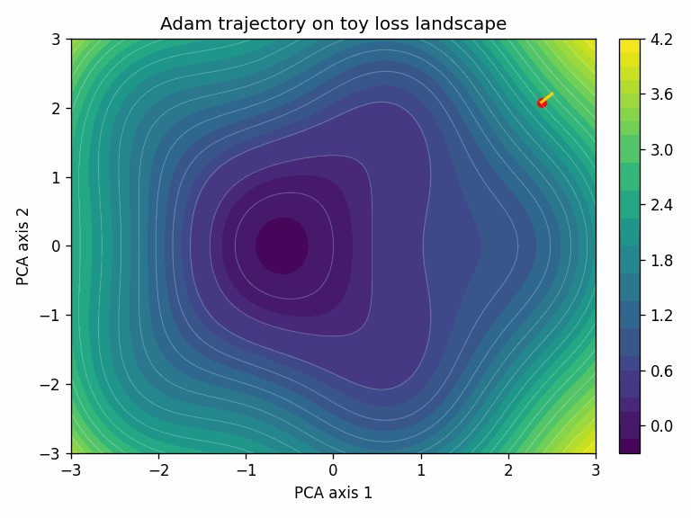
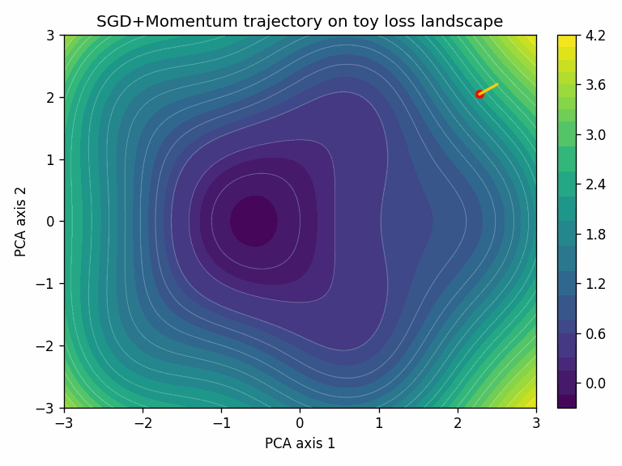

Optimizers are the most consequential part of deep learning that most practitioners never examine closely. You pick one, set a few hyperparameters, and move on.

That trust is mostly earned. AdamW has been the safe bet for years. But optimizers have a long, eventful history, and the landscape is shifting again. This post traces how we got here, what actually changed at each stage, and where it's heading.

::: {.callout-note appearance="simple"}
## TL;DR

- **AdamW is still the default** for most deep learning training in early 2026, including LLMs, vision transformers, and diffusion models.
- **SGD + momentum** remains competitive for convolutional architectures with well-tuned schedules.
- **Conditioning-based methods** (Muon, NorMuon, TEON, ARO) are the most active research frontier, showing promising gains at 1B+ scale but not yet displacing AdamW in documented production recipes.
- **Choosing the wrong optimizer, or misconfiguring the right one, can waste 10-30% of a training run's compute budget.** The payoff for getting this right scales with your training spend.
:::

## Mental model

The goal of training is to find model parameters that minimize error on the data. Backpropagation computes the gradient, a direction that tells each parameter how to change to reduce the loss. But that gradient comes from a mini-batch, not the full dataset, so it's noisy. The optimizer decides what to actually do with it: how far to step, how to smooth out the noise, and what to remember from previous steps.

Those decisions break into four controls:

- **Direction**: where to move.
- **Step size**: how far.
- **Stability**: how to survive noise and curvature.
- **Resource cost**: memory, compute, and communication.

In notation: at step $t$, the optimizer converts gradient $g_t$ into update $\Delta \theta_t$. Most of the history below is about doing that conversion better. Each wave solved one bottleneck, then exposed the next one.

## Visual intuition

Here's a quick look at what an optimizer actually does, through two examples. The task is classifying points from two interleaved spirals, a simple 2D dataset but one where the decision boundary is non-trivial.

```{python}
#| label: fig-spirals-data
#| fig-cap: "The two interleaved spirals dataset. Each class follows an Archimedean spiral. The non-linear decision boundary makes this a useful toy problem for optimizers."
#| echo: false
#| fig-width: 5
#| fig-height: 5

import numpy as np
import matplotlib.pyplot as plt

np.random.seed(42)
n = 200
theta = np.linspace(0, 4 * np.pi, n)
r = np.linspace(0.3, 1, n)
noise = 0.08

x0 = r * np.cos(theta) + np.random.randn(n) * noise
y0 = r * np.sin(theta) + np.random.randn(n) * noise
x1 = r * np.cos(theta + np.pi) + np.random.randn(n) * noise
y1 = r * np.sin(theta + np.pi) + np.random.randn(n) * noise

fig, ax = plt.subplots(figsize=(5, 5))
ax.scatter(x0, y0, c='#1f77b4', s=10, alpha=0.7, label='Class 0')
ax.scatter(x1, y1, c='#ff7f0e', s=10, alpha=0.7, label='Class 1')
ax.set_aspect('equal')
ax.set_xlabel('$x_1$')
ax.set_ylabel('$x_2$')
ax.legend(frameon=True, fontsize=9)
ax.set_title('Spirals classification dataset')
plt.tight_layout()
plt.show()
```

The model is a small 2-layer neural network: 2 inputs, two hidden layers of 64 units with ReLU activations, and a 2-class softmax output (about 4,500 parameters total).

```{python}
#| label: fig-nn-arch
#| fig-cap: "Architecture of the 2-layer network used for the spirals task."
#| echo: false
#| fig-width: 10
#| fig-height: 3

import matplotlib.pyplot as plt
import matplotlib.patches as patches

fig, ax = plt.subplots(figsize=(10, 3))

layer_sizes = [2, 6, 6, 2]  # representative nodes (actual: 2, 64, 64, 2)
layer_labels = ['Input\n(2)', 'Hidden 1\n(64, ReLU)', 'Hidden 2\n(64, ReLU)', 'Output\n(2, softmax)']
layer_colors = ['#a8d5e2', '#95d5b2', '#95d5b2', '#f4a261']
x_positions = [0.12, 0.37, 0.63, 0.88]

node_radius = 0.05
y_center = 0.55

# Draw edges first (behind nodes)
for li in range(len(layer_sizes) - 1):
    n_left = layer_sizes[li]
    n_right = layer_sizes[li + 1]
    for i in range(n_left):
        y_left = y_center + (n_left - 1) / 2.0 * 0.13 - i * 0.13
        for j in range(n_right):
            y_right = y_center + (n_right - 1) / 2.0 * 0.13 - j * 0.13
            ax.plot([x_positions[li], x_positions[li + 1]], [y_left, y_right],
                    c='gray', alpha=0.2, lw=0.6, zorder=1)

# Draw nodes
for li, (n_nodes, color) in enumerate(zip(layer_sizes, layer_colors)):
    for i in range(n_nodes):
        y = y_center + (n_nodes - 1) / 2.0 * 0.13 - i * 0.13
        circle = plt.Circle((x_positions[li], y), node_radius,
                             fc=color, ec='#333333', lw=1.2, zorder=3)
        ax.add_patch(circle)
    # Ellipsis for hidden layers to indicate more nodes
    if n_nodes > 2 and li in [1, 2]:
        y_bottom = y_center - (n_nodes - 1) / 2.0 * 0.13 - 0.08
        ax.text(x_positions[li], y_bottom, '...', ha='center', va='top',
                fontsize=14, color='#333333', fontweight='bold')

# Labels below
for li, label in enumerate(layer_labels):
    ax.text(x_positions[li], 0.02, label, ha='center', va='bottom', fontsize=8)

ax.set_xlim(0, 1)
ax.set_ylim(-0.05, 1.05)
ax.set_aspect('equal')
ax.axis('off')
plt.tight_layout()
plt.show()
```

To visualize the training trajectory, we project the model's parameters at each training step down to 2D using PCA. The surface shows the loss landscape in that projected plane.

{fig-align="center" width="560px"}

{fig-align="center" width="560px"}

In this toy task, Adam converges faster. That's not always the case; SGD + momentum with a well-tuned schedule often generalizes better, especially for convolutional architectures.

[Repro steps and code](https://github.com/zzsi/blog/tree/main/examples/optimizer-bench/toy).

## 1960s to 2000s: foundations that never went away

In classical optimization, Newton's method converges fast by using the full curvature of the loss surface (the Hessian). But the Hessian for a model with $n$ parameters is an $n \times n$ matrix; for a 7B-parameter model, that's unthinkable. Plain gradient descent avoids this cost but converges slowly on ill-conditioned problems. The entire history of deep learning optimizers lives in the gap between those two extremes: get some of Newton's speed without Newton's cost.

The first key ideas predate modern deep learning:

- Polyak momentum (heavy ball) reduced zig-zag behavior in narrow valleys by accumulating a velocity term $v$ ([Polyak, 1964](https://doi.org/10.1016/0041-5553(64)90137-5)). Instead of stepping directly in the gradient direction, each update blends the current gradient with the previous velocity, so the optimizer builds up speed in consistent directions and dampens oscillations in noisy ones:

$$
v_{t+1} = \beta\, v_t + g_t,\qquad \theta_{t+1} = \theta_t - \eta\, v_{t+1}, \qquad v_0 = 0.
$$

  Here $\eta$ is the learning rate (step size), and $\beta \in [0, 1)$ controls how much history to keep. With $\beta = 0$ this reduces to plain gradient descent.

- Nesterov acceleration ([Nesterov, 1983](https://www.mathnet.ru/eng/dan/v269/i3/p543)) observed that standard momentum commits to a direction before seeing the gradient there. The fix: compute the gradient at a look-ahead position $\theta_t - \eta\beta\, v_t$, where momentum is already taking you, then correct course:

$$
v_{t+1} = \beta\, v_t + \nabla f(\theta_t - \eta\beta\, v_t), \qquad \theta_{t+1} = \theta_t - \eta\, v_{t+1}.
$$

  Compare with Polyak momentum above: the only change is where the gradient is evaluated. Instead of $\nabla f(\theta_t)$, we use $\nabla f(\theta_t - \eta\beta\, v_t)$. This "peek ahead" reduces overshooting and improves convergence on smooth objectives. Nesterov momentum appears in many high-performing SGD recipes today.
- Natural gradient ([Amari, 1998](https://doi.org/10.1162/089976698300017746)) addressed a different problem: standard gradient descent depends on how you parameterize the model. Amari proposed using the Fisher information matrix to define steepest descent in the space of distributions rather than the space of parameters. This makes the update invariant to reparameterization. The cost is prohibitive for large models (the Fisher is as expensive as the Hessian), but the idea directly inspired the scalable approximations K-FAC and Shampoo that appear later.

All three pointed in the same direction: a better-informed step is worth extra compute, up to a point. Finding that point is the recurring tension of optimizer design, and the rest of this post is largely about where different eras drew the line.

## 2010 to 2014: getting deep nets to train at all

Early deep learning leaned on SGD + momentum because it was cheap and scalable, but tuning was fragile ([Sutskever et al., 2013](https://proceedings.mlr.press/v28/sutskever13.html)).

In practice, engineers could train deeper models, but only with careful learning-rate schedules and a lot of trial and error.

Adaptive methods arrived quickly, each one fixing a limitation of the last:

- **AdaGrad** (2011) addressed a specific problem: in sparse settings (e.g. NLP with large vocabularies), rare features receive too-small updates under a single global learning rate. AdaGrad scales each parameter by the inverse square root of its accumulated squared gradients ([Duchi et al., 2011](https://jmlr.org/papers/v12/duchi11a.html)):

$$
h_t = h_{t-1} + g_t^2, \qquad \Delta\theta_t = -\frac{\eta}{\sqrt{h_t} + \epsilon}\, g_t.
$$

  Parameters with consistently large gradients get smaller steps; rare-but-informative parameters get larger ones. The weakness: $h_t$ only grows, so effective step sizes shrink monotonically. For long training runs on deep nets, learning can stall.

- **RMSProp** (2012) fixed this by replacing the cumulative sum with an exponential moving average, so old gradients are forgotten ([Hinton lecture notes, 2012](https://www.cs.toronto.edu/~tijmen/csc321/slides/lecture_slides_lec6.pdf)):

$$
h_t = \rho\, h_{t-1} + (1-\rho)\, g_t^2, \qquad \Delta\theta_t = -\frac{\eta}{\sqrt{h_t} + \epsilon}\, g_t.
$$

  With $\rho$ typically around 0.9, the denominator adapts to recent curvature rather than all of history. RMSProp became a practical default and the direct precursor to Adam.

- **AdaDelta** (2012) took a different approach: it eliminated the global learning rate entirely by normalizing updates using a running average of past updates, not just past gradients ([Zeiler, 2012](https://arxiv.org/abs/1212.5701)). Less common today, but it showed that the learning rate itself could be made adaptive.

By the end of this period, the design direction was clear: momentum-like smoothing plus per-parameter adaptive scaling. That combination set up Adam's rapid adoption in the next wave.

## 2014 to 2019: Adam wins, AdamW corrects

Adam became the default because its out-of-the-box hyperparameters worked reasonably well across tasks, with much less tuning than SGD required ([Kingma and Ba, 2014](https://arxiv.org/abs/1412.6980)).

The idea: combine momentum (a running average of gradients, like Polyak) with per-parameter scaling (a running average of squared gradients, like RMSProp). Note: $v_t$ here is the second moment estimate, unrelated to the velocity $v$ in momentum above.

$$
m_t=\beta_1 m_{t-1}+(1-\beta_1)g_t,\qquad
v_t=\beta_2 v_{t-1}+(1-\beta_2)g_t^2.
$$

Because $m_t$ and $v_t$ are initialized at zero, they are biased toward zero in early steps. Adam corrects for this by dividing by $(1-\beta_1^t)$ and $(1-\beta_2^t)$, where the exponent $t$ is the step number (e.g. at step 10 with $\beta_1=0.9$, the correction is $1/(1-0.9^{10}) \approx 1.54$). The bias-corrected estimates are $\hat{m}_t = m_t / (1-\beta_1^t)$ and $\hat{v}_t = v_t / (1-\beta_2^t)$. The update is then:

$$
\Delta\theta_t=-\eta\frac{\hat m_t}{\sqrt{\hat v_t}+\epsilon}.
$$

The denominator $\sqrt{\hat{v}_t}$ adapts the step size per parameter: dimensions with large gradients get smaller steps, and vice versa. Typical defaults ($\beta_1=0.9$, $\beta_2=0.999$, $\eta=10^{-3}$) worked well enough that many practitioners never changed them.

Two important caveats emerged:

- Adam showed convergence pathologies in certain settings: the adaptive step size could increase at the wrong time, preventing convergence. AMSGrad fixed this by tracking the running *maximum* of $\hat{v}_t$, ensuring effective learning rates never increase ([Reddi et al., 2018](https://openreview.net/forum?id=ryQu7f-RZ)). This was an important theoretical clarification, though in practice the next fix had more impact.
- Adding L2 regularization to the gradient (the standard way to implement "weight decay" in Adam) is not equivalent to true weight decay. The problem: when you add $\lambda\theta$ to the gradient and then divide by $\sqrt{\hat{v}_t}$, the regularization gets scaled differently for each parameter. Parameters with large gradients get *less* regularization than intended, and parameters with small gradients get *more*.

AdamW fixed the second issue by decoupling weight decay from the adaptive update ([Loshchilov and Hutter, 2017](https://arxiv.org/abs/1711.05101)). Instead of adding regularization to the gradient, it shrinks the weights directly after the Adam step:

$$
\theta_{t+1} = (1-\eta\lambda)\theta_t + \Delta\theta_t^{\text{adam}}.
$$

This was a small implementation change, but it made weight decay behave as intended regardless of the adaptive scaling. AdamW became the standard for Transformers and most modern architectures.

## 2015 to 2023: beyond Adam on multiple fronts

After Adam became the default, several parallel lines of work tried to improve on it along different axes. These developed concurrently, not sequentially.

### Curvature approximation

Full second-order methods (computing the Hessian) are too expensive for large models. But the idea of using *some* curvature information, cheaply, motivated two important lines of work.

**K-FAC** approximated the Fisher information matrix using Kronecker factorization ([Martens and Grosse, 2015](https://arxiv.org/abs/1503.05671)). The key insight: for a layer with input activations $a$ and output gradients $g$, the Fisher block can be approximated as $F \approx (aa^\top) \otimes (gg^\top)$, a Kronecker product of two much smaller matrices. Instead of storing and inverting a huge $n \times n$ matrix, you store and invert two matrices of size (input dim) and (output dim) separately. This gives stronger preconditioning than Adam's diagonal scaling, at a fraction of full second-order cost.

**Shampoo** generalized this idea to per-block matrix preconditioners that don't require the Fisher structure ([Gupta et al., 2018](https://arxiv.org/abs/1802.09568)). For a weight matrix $W \in \mathbb{R}^{m \times n}$, Shampoo maintains left and right preconditioners $L \in \mathbb{R}^{m \times m}$ and $R \in \mathbb{R}^{n \times n}$, and updates with $L^{-1/4} G\, R^{-1/4}$. This captures cross-parameter correlations that Adam's per-element scaling misses.

Neither became a broad default. The implementation complexity and tuning overhead exceeded what most teams would absorb. But they proved that structured preconditioning could outperform diagonal methods. That lineage matters: the 2024-2026 conditioning wave reuses the same motivation with simpler operational surfaces.

### Large-batch training

As batch sizes grew, optimization dynamics changed. The naive fix, scaling the learning rate linearly with batch size, breaks down because different layers have different gradient magnitudes. A single global learning rate either over-updates some layers or under-updates others.

LARS solved this with a layer-wise trust ratio ([You et al., 2017](https://arxiv.org/abs/1708.03888)). For each layer $l$, the local learning rate is scaled by the ratio of weight norm to gradient norm:

$$
\eta_l = \eta \cdot \frac{\|w_l\|}{\|g_l\|}.
$$

Layers with small weights relative to their gradients get smaller steps, preventing them from being blown up by an aggressive global rate. LAMB brought the same idea to Adam-style moments for large-batch language pretraining, enabling large-batch BERT training ([You et al., 2019](https://arxiv.org/abs/1904.00962)).

These methods solved throughput bottlenecks, even though AdamW remained the broad default. The lesson: at scale, optimizer choice is partly a hardware-efficiency decision, not only a convergence decision.

### Memory and systems

At Transformer scale, optimizer state is expensive. Adam stores two extra fp32 tensors per parameter (first and second moments), so optimizer state alone is 2x the model size, about 56 GB for a 7B-parameter model.

**Adafactor** addressed second-moment memory by factorizing it ([Shazeer and Stern, 2018](https://arxiv.org/abs/1804.04235)). Adam stores a full second-moment matrix $v_t$ with the same shape as each parameter. For a weight matrix $W \in \mathbb{R}^{m \times n}$, Adafactor instead stores row and column statistics $r_t \in \mathbb{R}^m$ and $c_t \in \mathbb{R}^n$, and reconstructs the second moment as their outer product: $\hat{v}_t \approx r_t\, c_t^\top / \text{mean}(r_t)$. This reduces memory from $O(mn)$ to $O(m+n)$ per matrix parameter, which was critical for scaling T5-class models.

**8-bit optimizer states** took a different approach: keep Adam's algorithm but quantize $m_t$ and $v_t$ to 8-bit integers with dynamic scaling, cutting state memory by roughly 75% with near-identical training behavior ([Dettmers et al., 2021](https://arxiv.org/abs/2110.02861)). This is now common in finetuning workflows.

**Communication-aware variants** like 1-bit Adam targeted distributed bandwidth by compressing the information exchanged between workers during training ([Tang et al., 2021](https://arxiv.org/abs/2102.02888)).

The best optimizer is not only mathematically elegant; it must fit systems constraints. For many teams, this is why AdamW kept winning despite stronger niche alternatives.

### Generalization and search

SAM (Sharpness-Aware Minimization) penalizes sharp minima by optimizing for the worst-case loss in a small neighborhood around the current parameters, the idea being that flatter minima tend to generalize better ([Foret et al., 2020](https://arxiv.org/abs/2010.01412)):

$$
\min_\theta \max_{\|\epsilon\| \le \rho} \mathcal{L}(\theta + \epsilon).
$$

In practice, the inner max is approximated with a single gradient ascent step: $\hat\epsilon = \rho\, g / \|g\|$, then the model is updated using the gradient at $\theta + \hat\epsilon$.

Many variants (Lookahead, RAdam, AdaBelief, AdaBound) tuned warmup and update coupling ([Lookahead](https://arxiv.org/abs/1907.08610), [RAdam](https://arxiv.org/abs/1908.03265), [AdaBelief](https://arxiv.org/abs/2010.07468), [AdaBound](https://arxiv.org/abs/1902.09843)). Some helped in niches, but few replaced AdamW/SGD defaults broadly.

Lion used the sign of a momentum-like term as the update, discovered through automated program search rather than manual design ([Chen et al., 2023](https://arxiv.org/abs/2302.06675)). It validated optimizer design as a search problem, though it did not displace AdamW broadly.

## 2024 to 2025: geometry returns

Muon-style methods reframed the problem. Adam scales each parameter independently; it doesn't account for how parameters within a layer interact. In practice, a few dominant directions in the weight matrix can hog the update while others are neglected. Muon reshapes the gradient to spread the update more evenly across directions ([Muon implementation](https://github.com/KellerJordan/Muon), [modular-duality framing](https://arxiv.org/abs/2410.21265)).

The key operation is polar decomposition. For a gradient matrix $G$, any matrix can be decomposed as $G = U S$ where $U$ is orthogonal and $S$ is symmetric positive semi-definite. Muon uses $U$, the orthogonal factor, as the update direction:

$$
\Delta\theta = -\eta\, \text{polar}(G), \quad \text{where } \text{polar}(G) = G\,(G^\top G)^{-1/2}.
$$

This ensures the update has equal magnitude across all directions, preventing any single direction from dominating. In practice, the matrix inverse square root is approximated cheaply using a few iterations of Newton-Schulz, avoiding the cost of a full SVD.

Early results showed Muon scaling competitively to 1B+ parameters ([Jordan et al., 2025](https://arxiv.org/abs/2502.16982)), with a simpler implementation surface than K-FAC or Shampoo.

By end-2025, this looked promising but not universal. AdamW still dominated documented frontier recipes.
So the open question entering 2026 became replication at larger scales, not just first-paper wins.

## Late-2025 to early-2026: conditioning wave

A broader conditioning-focused wave followed. All of these methods share a common structure: transform the gradient $G$ through some structured preconditioner $P$ before updating:

$$
\Delta\theta = -\eta\, P(G).
$$

In base Muon, $P(G) = \text{polar}(G)$. The new methods modify what goes into $P$, what $P$ does, or what happens after:

**NorMuon** adds per-neuron adaptive scaling *after* orthogonalization. It tracks a row-wise running second moment of the orthogonalized update $O_t = \text{polar}(M_t)$, then normalizes each row by its own RMS ([2025](https://arxiv.org/abs/2510.05491)) `[1B+, open-source]`:

$$
v_t = \beta_2\, v_{t-1} + (1-\beta_2)\,\text{mean}_{\text{cols}}(O_t \odot O_t), \qquad \hat{O}_t = O_t \,/\, (\sqrt{v_t} + \epsilon).
$$

This is essentially Adam-style adaptive scaling, but applied per neuron to the post-orthogonalization update rather than per element to the raw gradient.

**MARS-M** modifies what goes *into* the Muon pipeline. It replaces the raw stochastic gradient with a variance-reduced estimator before momentum and orthogonalization ([2025](https://arxiv.org/abs/2510.21800)) `[theory, small-scale, open-source]`:

$$
C_t = \nabla f(\theta_t, \xi_t) + \gamma_t \tfrac{\beta}{1-\beta}\bigl[\nabla f(\theta_t, \xi_t) - \nabla f(\theta_{t-1}, \xi_t)\bigr].
$$

The correction term uses the *same* mini-batch $\xi_t$ at both the current and previous iterate, reducing the variance of the momentum estimate at the cost of one extra gradient evaluation per step.

**Hyperparameter transfer for matrix preconditioners** showed that conditioning gains persist when transferring optimizer configs from small to large runs, making these methods more practical to tune ([2025](https://arxiv.org/abs/2512.05620)) `[1B+, protocol]`.

**TEON** changes the *structure* of the orthogonalization. Where Muon orthogonalizes each layer's gradient independently, TEON stacks $K$ same-shape layer gradients into a tensor, unfolds along a chosen mode, and orthogonalizes the unfolded matrix ([2026](https://arxiv.org/abs/2601.23261)) `[theory, 1B-range]`:

$$
\mathcal{O}_i(\mathcal{G}) = \mathcal{M}_i^{-1}\!\bigl(\text{polar}\bigl(\mathcal{M}_i(\mathcal{G})\bigr)\bigr),
$$

where $\mathcal{M}_i$ is the mode-$i$ matricization (unfolding) of the stacked tensor $\mathcal{G} \in \mathbb{R}^{m \times n \times K}$. This captures cross-layer correlations that per-layer Muon misses.

**ARO** changes the *coordinate system* in which the optimizer operates. It selects an adaptive rotation $R_t$ that maximizes instantaneous loss decrease, rather than using the gradient's own eigenstructure ([2026](https://arxiv.org/abs/2602.09006)) `[1B+, protocol]`:

$$
\Delta W_t = -\eta\, R_t\, f_t(R_t^\top M_t), \qquad R_t = \text{QR}\!\bigl(M_t\, f_t(R_{t-1}^\top M_t)^\top\bigr).
$$

The rotation at step $t$ depends on the previous step's rotated projection, creating a feedback loop between the rotation and the base optimizer. Base Muon is a special case where $R_t$ is fixed to the eigenvectors of $M_t M_t^\top$.

The shift: conditioning is becoming a primary design axis, not a side detail. Evidence labels above (`[1B+]`, `[theory]`, etc.) indicate maturity; most of these methods have open-source implementations but limited independent replication so far.

Community reports ([Muon comparisons](https://huggingface.co/blog/KingNish/optimizer-part1), [distributed Muon validation](https://huggingface.co/blog/bird-of-paradise/reproducing-and-validating-distributed-muon)) are useful early signals, though controlled evaluations remain more reliable before committing to large-scale runs.

## What won in practice by early 2026

Defaults remain fairly stable:

- Frontier LLMs and VLMs (vision-language models): AdamW + warmup + decay + gradient clipping + selective decay exclusions.
- ViTs (Vision Transformers): AdamW.
- CNNs: SGD + momentum remains strong.
- Diffusion and flow-matching models: Adam/AdamW, often with EMA (exponential moving average of weights).
- LARS/LAMB: useful in specific extreme-batch throughput regimes.

## Recipe chooser (2025 to early-2026)

| Setting | First choice | When to deviate |
| --- | --- | --- |
| LLM/VLM pretraining | AdamW + warmup/decay + clipping | Try Muon/conditioning if stability or scaling efficiency is bottleneck |
| Vision CNN | SGD + momentum + strong LR schedule | Use AdamW for transformer-heavy stacks or faster early convergence |
| ViT training | AdamW | Trial SAM or conditioning methods when plateaus appear |
| Diffusion/flow matching | AdamW (+ EMA) | Try Adafactor/low-precision states when memory dominates |
| Extreme large-batch throughput | LARS/LAMB | Stay with AdamW if batch size is moderate and tuning budget is limited |

### Starting hyperparameters

These are typical starting points, not universal optima. Always tune on your workload.

| Optimizer | Learning rate | beta1, beta2 | Weight decay | Notes |
| --- | --- | --- | --- | --- |
| AdamW (LLM) | 1e-4 to 6e-4 | 0.9, 0.95 | 0.01 to 0.1 | Warmup 1-5% of steps, cosine decay |
| AdamW (ViT) | 1e-4 to 3e-4 | 0.9, 0.999 | 0.01 to 0.3 | Higher decay common with strong augmentation |
| SGD + momentum (CNN) | 0.01 to 0.1 | momentum 0.9 | 1e-4 to 5e-4 | Step or cosine LR schedule |
| Muon | 0.01 to 0.05 | 0.9, n/a | 0.0 to 0.01 | Orthogonalization replaces some of weight decay's role |

### Fair comparison protocol

1. Same model and tokenizer.
2. Same token/image budget and data order.
3. Matched tuning budget across optimizers.
4. Report time-to-target, compute-to-target, and seed stability.

## Closing

From heavy-ball momentum to conditioning-heavy methods, optimizer history is mostly a story of recurring constraints in new forms: curvature, noise, scale, and hardware budgets. Innovation keeps happening because three forces (theory, empirical pressure, and systems constraints) keep interacting. Methods that survive usually satisfy all three.

By early 2026, AdamW is still the center of gravity. The next durable shift is likely to come from better directional control and structured conditioning, not just better scalar learning-rate heuristics. What to watch for in the rest of 2026:

- Whether conditioning methods (Muon-family, ARO, TEON) show consistent gains under independent replication at 10B+ scale.
- Whether hyperparameter transfer protocols make these methods usable without per-run tuning.
- Whether systems-level integration (fused kernels, native framework support) lowers the adoption barrier enough to challenge AdamW as the default baseline.

The optimizer that wins next will not just be mathematically better; it will be easier to deploy correctly at scale.
