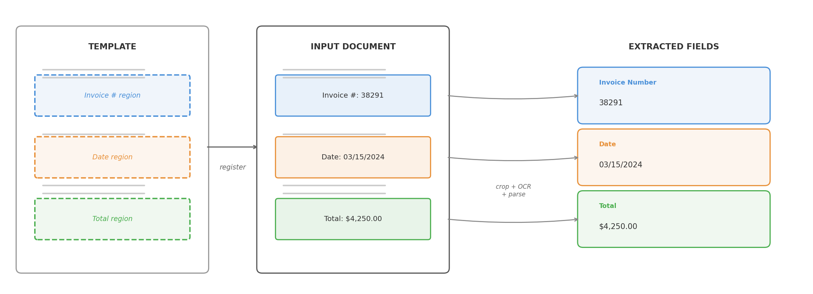
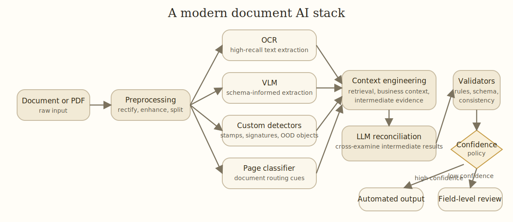

I've worked on document AI problems for about a decade. The business problem stayed mostly the same. The AI models, tools, and system design went through several paradigm shifts.

The core problem was to extract the right information from messy documents, map it into a schema, and make the result reliable enough for a real workflow. Sometimes contracts. Sometimes receipts, forms, statements, onboarding packets, tax documents.

The earliest systems I worked with used templates, image registration, and OCR. Then convnet-based detector-plus-OCR pipelines. Then transformer models that combined OCR text, layout, and image cues in one trainable system. Now the stack often includes OCR, vision-language models (VLMs), LLMs, validators, retrieval, post-training, and increasingly agentic tool use. Each phase mostly moved the bottleneck rather than eliminating it.

::: {.callout-note appearance="simple"}
## TL;DR

- Each generation of document AI mostly moved the bottleneck rather than eliminating it: from template brittleness, to pipeline complexity, to the cost of task-specific training data, to orchestration, evaluation, and hallucination.
- Foundation models changed the economics but didn't replace the system. The hard part shifted from getting models to extract useful information to making their output reliable and precise.
- Document AI is still a composed system, not a single model.
- In practice, evolving a document AI solution means balancing model capability, data quality, and system reliability. Improving one usually exposes the limits of the others.
:::

| Phase | Dominant stack | What improved | What became painful |
| --- | --- | --- | --- |
| Templates and heuristics (pre-2015) | Templates, registration, cropped OCR, rules | Fast wins on narrow stable forms | Template drift, registration failures, OCR brittleness |
| Detector-first pipelines (~2015-2020) | Object detectors + OCR + postprocessing | Better visual robustness and localization | Labeling burden, detector-OCR handoff, error propagation |
| Transformer models (~2020-2023) | OCR text + layout + image cues in one model | Easier supervision, stronger field extraction | Task-specific data prep, specialized models, single-page limits |
| Foundation-model systems (~2023-present) | OCR, VLMs, LLMs, validators, routing, post-training | Faster prototyping, stronger generalization, richer reasoning | Orchestration, confidence policy, evaluation, OOD robustness |

## What the business actually needed

People sometimes talk about document AI as if it were synonymous with OCR. It never was. You had to find the relevant regions, recover text from noisy scans or photos, infer structure from layout, connect information across fields and pages, normalize everything into a business schema, and validate that the results were internally consistent. And then you had to decide when the system should stop and ask a human for help.

That last part matters more than benchmark papers suggest. A document system is only useful when it knows when not to trust itself.

The demands of the business workflow drove the complexity of the pipeline, and determined the metrics that mattered. In our projects, the metric was usually field-level accuracy on structured field extraction. Even defining "correct" was harder than it sounds. Addresses can be broken into lines multiple valid ways. Dates appear in multiple formats. OCR introduces harmless whitespace differences. So evaluation always needed normalization logic and task-aware matching, not naive string equality.

Field-level accuracy then rolled up into what the business actually cared about: automation quality. Two coupled numbers:

- **automation coverage**: what percentage of work the system handles without human review
- **automation precision** (sometimes called straight-through accuracy): among the automated cases, how often the system is right

That's a policy problem as much as a modeling problem. No model is perfect, so the system needs a reliable estimate of when its extraction is wrong. A good confidence score lets the policy say "I'm not sure" and escalate to a human, rather than blindly committing an answer. This matters even more in the age of LLMs, where the model is eager to produce fluent output even when it's hallucinated.

I found it useful to think about evaluation in layers. Character- and word-level accuracy is about not losing information. Field-level accuracy is about extracting the right information. Automation coverage and automation precision (how much work the system handles, and how often it's right when it does) are about economic utility.

Depending on the task, standard supporting metrics also mattered:

- CER (character error rate) and WER (word error rate) for OCR quality
- field-level precision, recall, and F1 for schema-based extraction
- ANLS (average normalized Levenshtein similarity) for [DocVQA](https://www.docvqa.org/)-style tasks where near-matches deserve partial credit
- mAP at IoU thresholds for layout detection, for example on [DocLayNet](https://arxiv.org/abs/2206.01062)
- [TEDS](https://arxiv.org/abs/1911.10683) for table structure recognition

The right metric depends on the shape of the downstream decision.

That's why I'm skeptical of one-number evaluations in document AI. The system isn't trying to be correct in the abstract. It's trying to support a decision policy, which has tangible impact on cost, productivity, and revenue.

## Phase 1: templates, OCR, and heuristics

Before deep learning became practical for document tasks, the standard approach was straightforward: if a document class is stable enough, you can solve a lot with templates, image registration, OCR, and rules.

{width=600px fig-align="center"}

The pipeline had two parts. Offline, you defined a template for each document family, specifying where fields like "Invoice Number" or "Gross Pay" were expected to appear. At runtime, the system registered the input image against the template, cropped the field regions, ran OCR, and used anchor phrases, coordinates, and rules to parse the results into a schema.

If the document family was narrow, the scan quality acceptable, the registration reliable, and the downstream schema stable, template-heavy systems could be fast, cheap, and surprisingly accurate.

The downside was brittleness. Registration was never as reliable as you hoped once scans and photos got messy. Small layout shifts broke coordinate assumptions. A vendor changed a form revision and the parser quietly degraded. Handwriting, stamps, low-resolution scans, skew, or multi-page dependencies exposed how much the system was really held together by assumptions.

::: {.callout-tip appearance="simple"}
### Modern spin: templates, registration, and OCR

Templates haven't disappeared. They've been modernized in several ways.

**Template generation at scale.** VLMs and coding agents can now mass-produce templates and parsing rules from example documents, dramatically reducing the per-template engineering cost.

**Template retrieval.** When you have thousands of templates, matching an incoming document to the right one becomes its own problem. A practical approach is retrieval-reranking: use image embeddings and cosine similarity for fast recall, then a more expensive image-matching algorithm to rerank and confirm the best match.

**Image registration.** Classical registration relied on feature detectors (SIFT, ORB) and geometric solvers (RANSAC). Transformer-based matchers like [LoFTR](https://arxiv.org/abs/2104.00680) (2021) and [MatchAnything](https://arxiv.org/html/2501.07556v1) (2025) are more robust on low-texture regions, cross-modality pairs, and the kind of noisy scans that broke older pipelines.

**OCR itself.** The biggest shift is that OCR engines are increasingly VLMs. Models like [LightOnOCR-2](https://arxiv.org/abs/2601.14251) (1B parameters, under $0.01 per 1,000 pages), [DeepSeek-OCR 2](https://github.com/deepseek-ai/DeepSeek-OCR) (causal visual flow encoder for layout-aware reading order), [Granite-Docling](https://huggingface.co/ibm-granite/granite-docling-258M) (258M parameters), and [olmOCR 2](https://allenai.org/blog/olmocr-2) replace the traditional multi-stage OCR pipeline with a single end-to-end model. OCR is converging with document understanding rather than remaining a separate preprocessing step.
:::

## Phase 2: detector-first pipelines

By the mid-2010s, convolutional networks had proven they could reliably detect and localize objects in natural images. Models like Faster R-CNN (2015) and [RetinaNet](https://arxiv.org/abs/1708.02002) (2017) made it practical to apply the same ideas to documents: train detectors to find regions of interest like tables, signatures, key-value fields, checkboxes, and headers.

Even a moderately good detector could absorb variability that broke template-only systems. You could ask a model to find a field rather than hard-coding its location. But this came with new upfront work: you needed labeled bounding boxes for every field type, enough training examples to cover layout variation, and a training pipeline to produce and maintain the detector.

The pipeline was clear: extraction was tackled in a sequence of isolated steps.

- detect the field region
- run OCR on the detected region
- parse and normalize the result

<!-- TODO: illustration of the 3-step pipeline (detect, OCR, parse) -->

The system combined vision and language, but each component worked in isolation. Vision handled localization. OCR handled text recognition. Rules handled interpretation. That split was often right for the tools of the time, but it came with painful handoff boundaries. If the detector missed the box, OCR never had a chance. If OCR garbled the crop, the parser failed. If table structure was slightly off, everything downstream became an exception case.

Better perception didn't automatically mean simpler systems. The error propagation across stage boundaries was the fundamental cost of this architecture.

### A concrete example from 2018: real estate contracts

Around 2018, one document class I worked on was real estate contracts. On paper, straightforward: find predefined fields, map them into a schema. In practice, geometry dominated the work.

We were mainly extracting from historical contracts to unlock analytics, not automating live intake. Success was measured by field-level accuracy against manually entered ground truth, with the usual caveat that even human-entered values were not perfectly clean.

Some fields were tiny. An option period might span only a couple of characters, a tiny fraction of the page. Other fields were long and horizontally stretched, a bad fit for the default anchor-box assumptions in detectors like [RetinaNet](https://arxiv.org/abs/1708.02002). Multiline address fields introduced ambiguity even at labeling. When does one field end and another begin?

The common pattern: detect the field region, crop it, send the crop to a commercial OCR engine (Google Cloud Vision, Amazon Textract), parse and normalize. Powerful enough to be useful, but the coupling between detection and OCR was painfully obvious. If the detection box was off by a little, OCR degraded immediately.

Those elongated and tiny fields were a good example. Initially some had mAP around 20%, even after training on tens of thousands of examples. Once we fixed the anchor-box setup for those geometries, they jumped above 90%. The model wasn't "bad at the task." It was badly matched to the object geometry we cared about.

That project made me appreciate how much document AI depends on mundane geometric details. It wasn't enough to say "use a detector." You had to ask what shapes it was biased toward, how small a target it could reliably localize, and how much labeling ambiguity you were baking in.

### Another example from 2020: receipt understanding

Around 2020, colleagues worked on receipt understanding. I wasn't directly on the project, but the engineering lessons were instructive.

Receipts are deceptively hard. Images often came from phone photos: weird angles, blur, shadows, partial occlusion, inconsistent lighting. Some receipts were long enough that users captured them in multiple photos, which meant a stitching problem before extraction even began. And unlike a flat key-value form, the output schema had nested structure: line items under subtotals and totals, with all the ambiguity that implies.

This exposed the limits of thinking about document understanding as isolated local predictions. You needed to reconstruct a coherent object from messy visual evidence, impose structure on repeated rows, and keep the hierarchy intact. Better preprocessing (rectification, super-resolution) helped both detectors and OCR. Stitching multiple receipt images together added another large gain.

## Phase 3: transformer models that combine cues

Transformer models didn't make document AI multimodal for the first time. We were already combining visual and text signals. What they changed was how that combination happened. Instead of stitching cues across multiple stages, we could train models that combine OCR text, layout, and image features end to end.

<!-- TODO: architecture diagram, e.g. LayoutLMv3 Figure 3 (https://ar5iv.labs.arxiv.org/html/2204.08387/assets/x2.png) showing text tokens + image patches + 2D layout → unified Transformer -->

The model could learn patterns like:

- this token means something different depending on where it appears
- nearby fields provide semantic context
- document layout carries information that plain text alone loses
- the same phrase can play different roles across forms

This was the first time many document understanding tasks felt natively modeled rather than patched together. It also made the new bottleneck obvious: data.

These models were much better once properly trained, but they weren't magic. You still needed labeled examples, annotation conventions, decisions about prediction targets, and retraining plans when the document mix changed.

The pain shifted. In earlier systems it was brittle rules. Now it was dataset curation, labeling operations, task framing, and model maintenance.

### A concrete example from 2022: transformer models for document understanding

Around 2022, we adopted transformer models like [LayoutLMv3](https://arxiv.org/abs/2204.08387) for document understanding. The best part wasn't that the models were zero-shot (they weren't). The best part was that the shape of the task changed.

We could take image pixels plus OCR text as input and predict which OCR tokens answered a question. That was a much more natural fit than drawing and detecting field boxes first.

Operationally, this looked like token classification over OCR words. We didn't need to hand-label bounding boxes for every field region. The manual labeling only needed to specify the final answer, and we built an inverse labeling process to project those answers back onto token-level supervision. That cut annotation burden significantly and let us train on more data.

The transformer layers could cross-reference signals in ways our older pipelines couldn't. Text content, token position, page layout, and visual context all informed the prediction jointly. A word was no longer interpreted in isolation.

The models were larger, but the cost was acceptable. Model inference time was still small compared with the rest of a real production pipeline: retrieving PDFs from data sources, querying databases, and doing all the ordinary glue work around the model.

In hindsight, I should have used the model earlier to audit the labels. These were practical extraction workflows where the ground truth came from existing human-entered systems, imperfect by nature. I already knew from active learning and error analysis that comparing predictions against ground truth can surface labeling errors faster than random spot checks. But I was too focused on pushing the benchmark score higher. Some of what looked like a model limit was actually label noise in the human-entered answers. That made me put much more weight on data quality, active learning, and human-in-the-loop workflows.

## Phase 4: foundation models changed the shape of the stack

Modern OCR engines are much stronger than they used to be. Vision-language models can reason over pages more flexibly. Large language models handle schema mapping, normalization, and conditional extraction well. Long-context models make multi-page reasoning more tractable. Prompting and few-shot examples often get you surprisingly far before any custom training.

The consequence isn't just that accuracy went up. The architecture of the system changed.

For a growing set of document problems, you can now start from something like:

- extract text and page images
- send the right representation to a VLM or LLM
- ask for structured output in a target schema
- run validators and business-rule checks
- retry, route, or escalate when confidence is low

That reduces the task-specific modeling you need up front. It also makes some annoying problems more approachable: fuzzy field definitions, cross-page references, lightweight reasoning, documents that don't fit a pre-trained template.

But this shift creates a trap. It's tempting to think the model has replaced the system.

It hasn't.

More of the complexity moved into orchestration:

- when to use OCR text, raw image, or both
- which model to route a document to
- how to enforce structured outputs
- how to validate extracted values against business rules
- when to re-prompt, fall back, or send to a human
- how to measure regression when prompts, models, or providers change

In older stacks, the fragility lived in templates and hand-tuned pipelines. Now it often lives in orchestration and evaluation.

Another important change: [agentic](https://arxiv.org/abs/2210.03629) control flow. In older systems, we wired steps together deterministically: classify the page, run OCR, call the detector, parse, validate, done. The sequence was fixed. In newer systems, we increasingly provide the model with context and tools and let it decide which steps to invoke and in what order.

<!-- TODO: side-by-side diagram comparing deterministic pipeline (fixed sequence of boxes) vs. agentic flow (LLM + tools with dynamic routing) -->

The tools, schemas, validators, and review policy are still designed by us. But the extraction flow no longer has to be a rigid hand-authored pipeline. For messy documents, that flexibility matters. The model can inspect a page more closely, compare OCR output with visual evidence, call retrieval utilities, or reconcile conflicting results before committing to an answer. The tradeoff is predictability: deterministic pipelines are easier to debug and audit, while agentic flows handle edge cases more gracefully but are harder to trace when they go wrong.

### A concrete example from 2024 to 2026: multi-model systems and post-training

What defined this phase wasn't replacing the old stack with a single foundation model. It was wiring together multiple models and utilities so each could do what it was best at.

Across several projects, the stack often included:

- a VLM for schema-informed extraction on single-page or small multi-page inputs
- OCR for high-recall generic extraction
- custom detectors for stamps, signatures, and other out-of-distribution visual objects
- page classifiers
- heuristic image-preprocessing modules
- retrieval or knowledge utilities for context engineering
- LLMs for cross-examining intermediate results from multiple models

{width=900px fig-align="center"}

The components weren't interchangeable. OCR was the recall-oriented layer. The VLM was useful when extraction depended on layout and semantic intent. Custom detectors still mattered for niche objects that general models handled unreliably. LLMs were useful not just for extraction, but for reconciling conflicting evidence across model outputs.

That last point changed how I thought about the problem. In earlier pipelines, model outputs were treated as final. In these newer systems, intermediate outputs became evidence that could be compared, challenged, and combined. A modern document pipeline looks less like a linear parser and more like a system where specialized components check each other's work, sometimes driven by the model itself through tool-use decisions rather than a fixed sequence.

We also found that post-training still mattered.

For some VLM use cases, supervised fine-tuning helped both with output format and accuracy on inputs that were out of distribution for the base model, such as low-quality scans, handwritten content, and unfamiliar formats like music sheets.

But SFT had limits. It gave an initial accuracy bump and improved formatting, then plateaued. Pushing beyond that is where we spent a lot of time on RL with verifiable rewards. Getting RL to work reliably was much more demanding. Reward design, verification logic, training stability, and evaluation all mattered.

So even in the foundation-model phase, the story wasn't "prompting replaced training." Prompting widened the starting point. Post-training still mattered when you cared about domain robustness, output discipline, and performance on ugly real-world inputs.

This phase also brought new practical pain points that are still unfolding. Production documents are often sensitive (contracts, tax forms, medical records), and compliance constraints make it hard to access real data for experimentation. That limits both how quickly you can iterate and how representative your evaluation sets are. To compensate for the lack of both documents and labels, we invested in synthetic data generation: simulating printing artifacts, scanner noise, paper distortion, stamps, and handwritten notes over programmatically generated documents. It's not a perfect substitute for real data, but it meaningfully expanded the training distribution.

Hallucination is the other open problem. VLMs can confidently extract values that aren't in the document, or subtly misread a field while producing well-formatted output that looks correct. This is harder to catch than an OCR error because the output is fluent. We're addressing it with visual and textual grounding tools, forcing the model to point back to specific regions or tokens in the source document rather than generating answers from its parametric memory alone. It helps, but it's not solved.

This phase was also enabled by open-source tooling and models: [Hugging Face Transformers](https://huggingface.co/docs/transformers/index), [TRL](https://huggingface.co/docs/trl/index), [Unsloth](https://github.com/unslothai/unsloth), and [Miles](https://github.com/kungfuai/miles) on the tooling side, and model families like [Llama](https://ai.meta.com/llama/), [Mistral](https://mistral.ai/), [Qwen](https://huggingface.co/Qwen), and [Nemotron](https://developer.nvidia.com/nemotron) on the modeling side.

### End-to-end tuning of compound systems

Until recently, tuning a compound system meant optimizing each component separately and hoping the composition held. That's changing. Tools like [DSPy](https://dspy.ai/) treat LLM programs as optimizable computation graphs, and its [GEPA](https://arxiv.org/abs/2507.19457) optimizer uses evolutionary search to improve prompts across a pipeline. [AFLOW](https://arxiv.org/abs/2410.10762) takes a different angle, using Monte Carlo Tree Search to generate and refine agentic workflows. [TextGrad](https://arxiv.org/abs/2406.07496) backpropagates natural-language feedback through computation graphs.

I've used GEPA to tune text-based knobs in document extraction pipelines: system prompts, instruction fragments, and pieces that get assembled into a final prompt. It's early, but the idea of optimizing the whole pipeline against a task-level objective rather than tweaking components one at a time feels like the right direction for composed systems.

## Each phase had its own misconception

Looking back, it's striking how each phase came with its own version of "this will be enough":

- **Templates and heuristics:** if I keep adding templates, I can cover all document types. In reality, templates drift, scans distort, and registration is much less reliable than it first appears.
- **Detector-first pipelines:** if the detector and the OCR each work well, I'm done. In reality, the integration boundary between them is where errors compound.
- **Layout-aware transformers:** if the model works on one document family, I can reuse it broadly. In reality, these models still need new task data when the document or extraction target changes.
- **Foundation models:** I can just throw documents at an API and get the answer. For simple tasks, increasingly true. For messy, mission-critical extraction on large real documents, there's still a substantial gap.

## If I were starting today

I'd start much more pragmatically than I would have ten years ago.

Narrow workflow. High-quality OCR. Strong general multimodal model. Tight output schema. Validators early. An evaluation set before a large custom modeling effort. Study the failure distribution before deciding whether the next step is prompting, routing, fine-tuning, better OCR, or human-in-the-loop review.

I'd resist the temptation to ask a single model to do everything. The strongest systems I've seen are composed: OCR for recall, VLMs for visual understanding, LLMs for reasoning and normalization, validators for trust, confidence routing for the long tail, and human review as the safety net. Less elegant than a pure end-to-end story, but it matches reality.

In those composed systems, confidence policy deserves more attention than it usually gets. It rarely relies on any single model score. What works better is agreement: do OCR, VLM, and LLM outputs converge? Do validators pass? Field-level review should focus on uncertain fields rather than sending whole documents to manual fallback. The review path should become increasingly infrequent over time, but it's what makes the rest of the automation trustworthy.

I'd also put more weight on data quality than I used to. Not just labeling more data, but auditing labels, closing the loop between model predictions and annotation errors, and building evaluation sets that actually represent the ugly inputs the system will face. The ceiling is usually in the data before it's in the model.

Benchmark wins and production wins are not the same thing. A model can look impressive on a public task and still be awkward in a real workflow where documents are incomplete, mislabeled, duplicated, rotated, partially photographed, or mixed with irrelevant pages. The most important property of a document system is often not raw intelligence. It's calibrated reliability.

The field has changed enormously. The production question still feels familiar: how do you turn messy documents into dependable decisions? Not with a single breakthrough. With the discipline of building systems that combine perception, language, validation, and operational feedback, and knowing when the machine should stop and ask for help.
